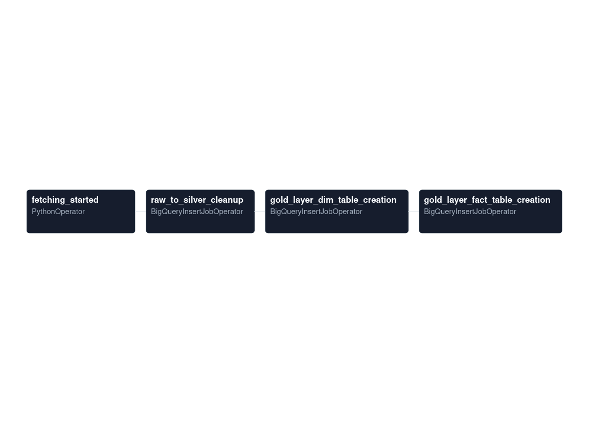

# Connecticut Real Estate data warehouse project (2026)

## Description:
> An **automated data pipeline**, which fetches messy real estate data from connecticut `SODA 2.0` API and uploads the data to a `bigquery` warehouse. A well-curated `medallion architecture` filters the raw data and establishes `star schema` in the `gold` layer of the warehouse to have cleaned, non-duplicate data for dashboard designing.

## Project features:
1. Fetches raw data from the **API** and puts it directly to a **bigquery cloud warehouse**
2. **Implementation of medallion structure** :-
    1. `raw layer` -> Direct data upload from the API. Working as a `data lake`.
    2. `silver layer` -> Sets the data free from *numerical value outliers*, *null values*, *random object anomalies* etc and prepares the data for gold layer.
    3. `gold layer` ->  Implemented a simple `star schema` for better dashboard performance & **filtering**
3. Yearly and place wise `assessed value` and `sale amount` tracker using **streamlit**

## Data flow diagram

> Image below shows the **data flow path** of the pipeline:

### Description about the workflow:

1. API data fetch operation & bigquery raw data upload thorugh airflow **task 1**

2. Raw to silver layer **data transformation** thorugh `SQL` logic (removing outlier numerical values, fixed object values and cleaned data's from columns such as town, address) thorough airflow **task 2**

3. **gold layer** implementation through **task 3 & 4** to create fact and dimensional tables and established relationships between them

> **Apache airflow** tasks workflow:

> Description about the airflow processes:

1. **fetching_started**
    * Most **heavy task** among all tasks in this project. This fetches the data from the `SODA 2.0 API` and uploads the data in chunksize (50000 rows) portions to the bigquery `raw` layer dataset.

2. **raw_to_silver_cleanup**
    * cleans the data for `gold layer` to have perfect data (null free, above 0 etc) to **design star schema**.

3. **gold_layer_dim_table_creation**
    * A `SQL script` with `SCD-1 implementation` to have property and residential based dimension table.

4. **gold_layer_fact_table_creation**
    * A `SQL script` with SCD-1 implementation. In the SCD-1 implementation, it is approved data addition if **descriptive data doesn't matched** but **frequent columns such as "serial_number", "list_year" etc does have matching entries**.
----

## Problems solved:

- The medallion architechture fetches the raw data and filters it to more `cleaner` version of the data inside the same architechture, without any need of external database and tools implementation. The whole architechture is working as a `datalake` and also a `data filtering machine`.

- Without any aggressive data cleaning, the datalake dropped around `~8.5%` of data from the `raw` layer for the `gold` layer ready for dashboard features.

- With the help of `airflow`, this whole data pipeline is automated and it will fetch newer data from the API on **1st** and **15th** of every month.

- Implementation of `SCD` (slowly changing dimensity) `type 1` helps in getting rid of duplicate entries from the API, maintaining the clean data in bigquery.

- Implemented curately structured `MERGE` and `USING` conditions on `fact` table. Used `WHEN MATCHED` on most repeated columns but put filter on descriptive columns such as `town`, `assessed_value`, `sale_amount` etc to get only newer data if it is changed, otherwise the warehouse will update newer data.

- Designed a simple star schema for better dashboard filtering on powerBI and performance.

----

